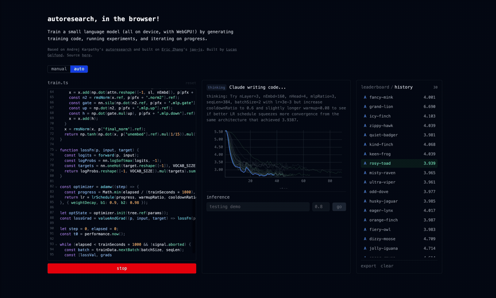

# autoresearch-webgpu

Browser port of [Karpathy's autoresearch](https://github.com/karpathy/autoresearch)! autoresearch-webgpu:
- uses a language model to create a `train.ts` file, with a basic model training loop
- runs model training in the browser, using the device GPU (powered by `jax-js`, thanks [@ekzhang](https://github.com/ekzhang)!)
- evaluates the loss / results of the experiments, and feeds them back to an agent to generate new code! 

There's noting else particularly crazy about this repo - it's a standard Svelte app. I was mostly just curious to try this out (+ send to others) and didn't want to do the Python install! 

Try the live demo at [autoresearch.lucasgelfond.online](https://autoresearch.lucasgelfond.online)
